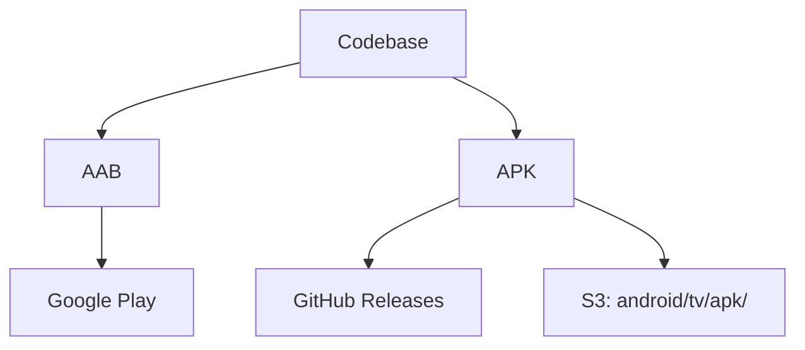
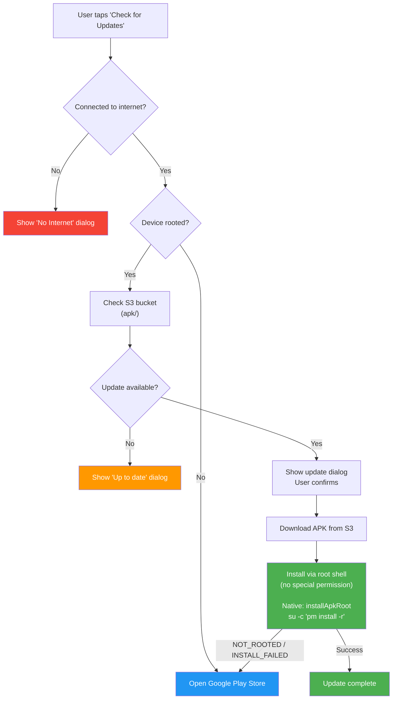
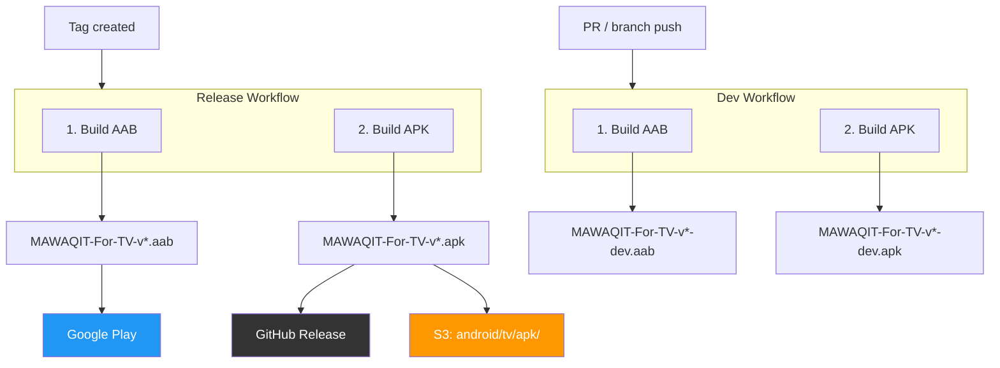

# Update Logic

## Build Artifacts

## Update Flow

## CI/CD Pipeline (Codemagic)

## Summary Table

| Scenario | Update Source | Install Method |
|---|---|---|
| Rooted device | S3 (`apk/`) | `su -c "pm install -r"` — falls back to Play Store on failure |
| Non-rooted device | Google Play | Play Store |

## Key Files

| File | Role |
|---|---|
| `android/app/build.gradle.kts` | Android build config (no product flavors) |
| `android/app/src/main/AndroidManifest.xml` | App manifest (no install permission needed) |
| `lib/src/state_management/manual_app_update/manual_update_notifier.dart` | Picks S3 APK (non-sideload), installs via root |
| `lib/src/pages/SettingScreen.dart` | Routes update flow based on root status |
| `android/.../MainActivity.kt` | Native `installApkRoot` method (`su pm install`) |
| `codemagic.yaml` | Builds AAB + APK, uploads to S3 / GitHub / Play Store |
