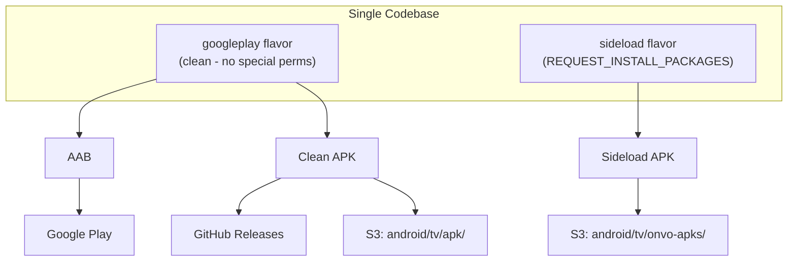
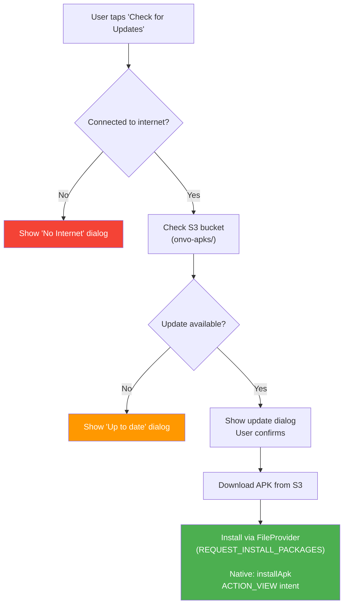
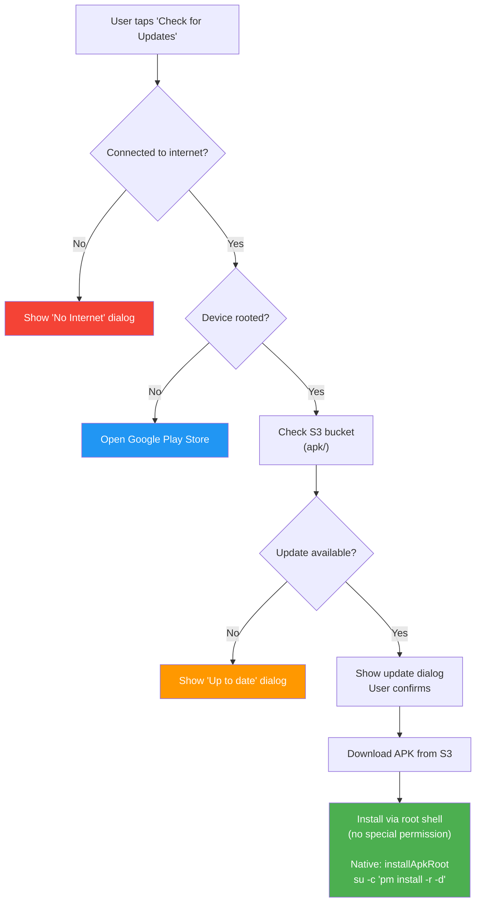
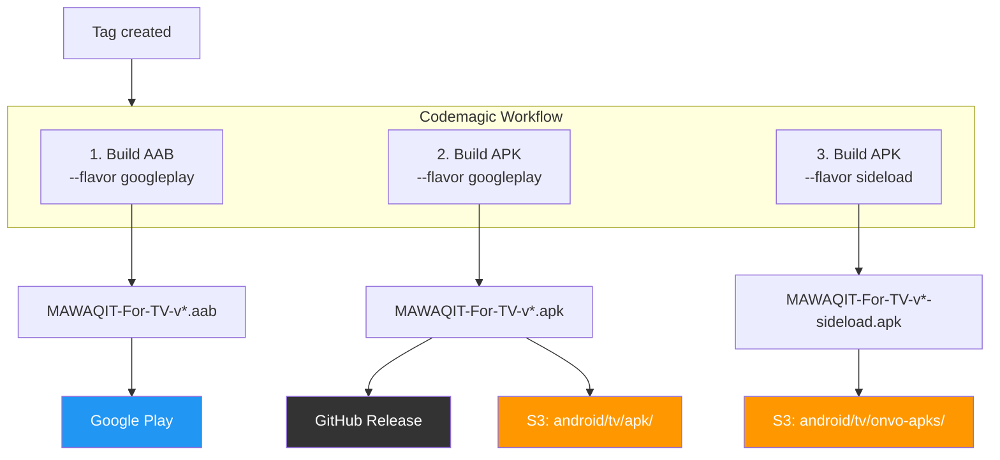

# Update Logic - Dual Flavor Architecture

## Build Artifacts

## Update Flow - Sideload Flavor

## Update Flow - Google Play (Clean) Flavor

## CI/CD Pipeline (Codemagic)

## Summary Table

| Scenario | Flavor | Update Source | S3 Bucket | Install Method |
|---|---|---|---|---|
| Any device | sideload | S3 | `onvo-apks/` | FileProvider (REQUEST_INSTALL_PACKAGES) |
| Rooted device | googleplay | S3 | `apk/` | `su -c "pm install -r -d"` |
| Non-rooted device | googleplay | Google Play | - | Play Store |

## Key Files

| File | Role |
|---|---|
| `android/app/build.gradle.kts` | Defines `googleplay` and `sideload` product flavors |
| `android/app/src/sideload/AndroidManifest.xml` | Adds `REQUEST_INSTALL_PACKAGES` for sideload only |
| `android/app/src/main/AndroidManifest.xml` | Shared manifest (no install permission) |
| `lib/src/const/constants.dart` | `kAppFlavor` / `kIsSideloadFlavor` compile-time constants |
| `lib/src/state_management/manual_app_update/manual_update_notifier.dart` | Picks `installApk` vs `installApkRoot` based on flavor |
| `lib/src/pages/SettingScreen.dart` | Routes update flow based on flavor + root status |
| `android/.../MainActivity.kt` | Both native install methods (`installApk` + `installApkRoot`) |
| `codemagic.yaml` | Builds all 3 artifacts with correct `--flavor` and `--dart-define` |
